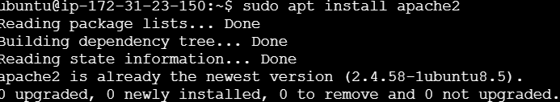

# Instalar Apache
1. Como ya hemos hecho multiples veces en Proxmox sere rápido:
`````
sudo apt update
`````
`````
sudo apt upgrade
`````
`````
sudo apt-get install apache2
`````
<br>

<br>
# Activar la autenticación con MySql
1. Instalamos PHP, MySQL y MariaDB.
`````
sudo apt-get install apache2 php7.0 libapruti11-dbd-mysql -y
`````
`````
sudo apt-get install mariadb-server mariadb-client -y
`````
2. Tras activar los sercicios de apache y mysql ("sudo systemctl enable apache2" y "sudo systemctl enable mysql") abriremos este último para crear en el una base de datos:
`````
sudo mysql -u root -p
`````

`````
create database defaultsite_db;
`````
# Crear un certificado autofirmado y activar el módulo SSL
