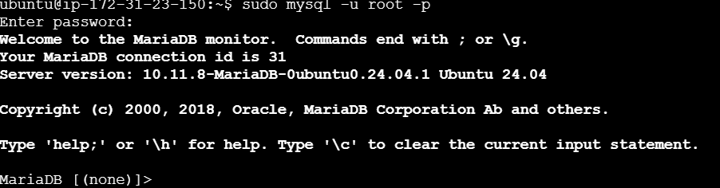
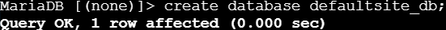

# Instalar Apache
1. Como ya hemos hecho multiples veces en Proxmox sere rápido:
`````
sudo apt update
`````
`````
sudo apt upgrade
`````
`````
sudo apt-get install apache2
`````
<br>

<br>
# Activar la autenticación con MySql
1. Instalamos PHP, MySQL y MariaDB.

`````
sudo apt-get install apache2 php7.0 libapruti11-dbd-mysql -y
`````
`````
sudo apt-get install mariadb-server mariadb-client -y
`````
2. Tras activar los sercicios de apache y mysql ("sudo systemctl enable apache2" y "sudo systemctl enable mysql") abriremos este último para crear en el una base de datos:

`````
sudo mysql -u root -p
`````
<br>

<br>

`````
create database defaultsite_db;
`````
<br>

<br>
3. Dar permisos.

`````
GRANT SELECT, INSERT, UPDATE, DELETE ON defaultsite_db.* TO 'defaultsite_admin'@'localhost' IDENTIFIED BY 'usuario';
`````


`````
GRANT SELECT, INSERT, UPDATE, DELETE ON defaultsite_db.* TO 'defaultsite_admin'@'localhost.localdomain' IDENTIFIED BY 'password';
`````


`````
flush privileges;
`````

4. Entramos en la base de datos y creamos una tabla:
`````
use defaultsite_db;
`````

`````
create table mysql_auth ( username varchar(191) not null, passwd varchar(191), groups varchar(191), primary key (username) );
`````


5. Para autentificar el usuario convertimos la contraseña en hash y luego insertaremos los datos de la tabla
`````
htpasswd -bns siteuser siteuser
`````


6. Abriremos de nuevo nuestra base de datos con ("sudo mysql -u root -p" y "use defaultsite_db") y escribilos los datos de la tabla:

`````
INSERT INTO `mysql_auth` (`username`, `passwd`, `groups`) VALUES('siteuser', '{SHA}tk7HEH6Wo7SKT6+3FHCgiGnJ6dA=', 'sitegroup');
`````


7. Salimos con "ctrl + z" y activamos todos los módulos con los comandos que se ven en la imagen:


8. Por último "sudo mkdir /var/www/html/protecteddir" y "sudo chown -R www-data:www-data /var/www/html/protecteddir" y terminamos de configurar apache abriendp ("sudo nano /etc/apache2/sites-available/000-default.conf"):


# Crear un certificado autofirmado y activar el módulo SSL
