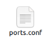
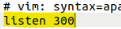
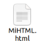

## Crea un script que añada un puerto de escucha en el fichero de configuración de Apache. El puerto se recibirá como parámetro en la llamada y se comprobará que no esté ya presente en el fichero de configuración.

1. Para comenzar, accedemos al directorio donde se encuentra la configuración de Apache
`````
cd /etc/apache2
`````
2. Y una vez dentro, procedemos a crear y editar un script que llevará a cabo las acciones necesarias. Al abrir el editor de texto, desarrollaremos el contenido correspondiente.
`````
gedit Nombre.sh
`````
`````
#!/bin/bash

if [ $# -eq 0 ]; then
  echo 'Error'                     
else
  grep "$1" ports.conf             
                                   

  if [ $? -ne 0 ]; then            
    cp ports.conf ports.bak        
    echo "listen $1" >> ports.conf
  else
    echo 'Puerto configurado'
  fi
fi
`````
3. Tras escribir el script, ejecutamos este comando:
`````
bash NombreScript.sh NumeroPuerto
phpinfo
`````
(por ejemplo, Actividad1.sh 300)

4. Durante la ejecución si el puerto no existe, se genera una copia de respaldo del archivo de configuración antes de añadir el puerto, en el archivo llamado ports.conf



## Crea un script que añada un nombre de dominio y una ip al fichero hosts. Debemos comprobar que no existe dicho dominio en el fichero hosts

1. Primero, ingresamos en el directorio donde se encuentra el archivo de configuración correspondiente con "cd /etc/" para, después, crear y editar un script que gestionará la inclusión del dominio y la IP. En el editor de texto, redactamos las instrucciones necesarias para que el script verifique si el dominio ya está configurado y, de no estarlo, realice una copia de seguridad y lo añada al archivo.
`````
sudo gedit Nombre.sh
`````
`````
#!/bin/bash

if [ $# -eq  0 ]; then
  echo 'Error';
else
  grep "$1" hosts

  
  if [ $? -ne 0 ]; then
                                    

    cp hosts hosts.bak
    echo "$2  $1" >> hosts
  else
    echo 'Dominio ya existente'
  fi
fi
`````

## Crea un script que nos permita crear una página web con un título, una cabecera y un mensaje

1. Accedemos al directorio destinado a gestionar los archivos y dominios web con "cd /var/www/" para a crear y editar un script que automatice la creación de una página HTML (usando de nuevo "sudo gedit Nombre.sh").
`````
#!/bin/bash

if [ $# -eq 0 ]; then
  echo 'Error'
else

  FILE="/var/www/(Dominio)/(Título).html"
  if [ ! -f "$FILE" ]; then

    if [ -d "(Dominio)" ]; then
      echo "<!doctype html>" > Dominio/Título.html     
      echo "<html>" >> (Dominio)/(Título).html
      echo -e "\t<head>" >> (Dominio)/(Título).html
      echo -e "\t\t<title>(Título)</title>" >> (Dominio)/(Título).html
      echo -e "\t</head>" >> (Dominio)/(Título).html
      echo -e "\t<body>" >> (Dominio)/(Título).html
      echo -e "\t\t<h1>(Encabezado)</h1>" >> (Dominio)/(Título).html
      echo -e "\t\t<p>(Texto)</p>" >> (Dominio)/(Título).html
      echo -e "\t</body>" >> (Dominio)/(Título).html
      echo "</html>" >> (Dominio)/(Título).html
    else
      echo "(Dominio) no existe"
    fi
  else
    echo "La página titulada (Título) ya existe"
  fi
fi
`````
(Todo lo que va entre paréntesis es lo que deberemos modificar en función de lo que querramos poner en el html)
2. Por último lo ejecutamos para comprobar que la página web se genera correctamente.


