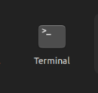
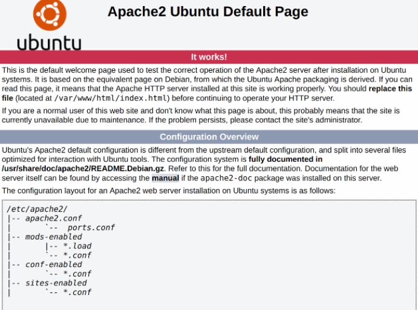
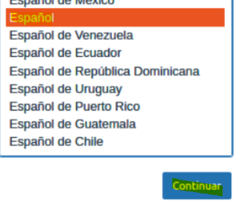
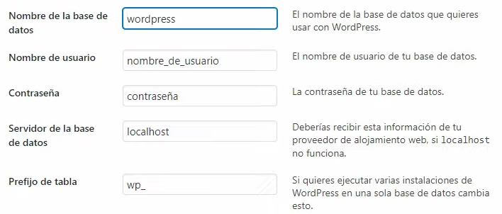
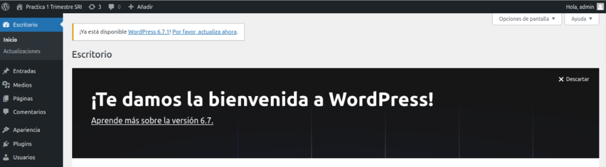
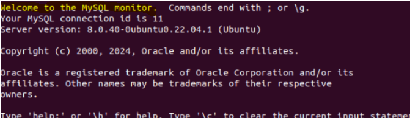
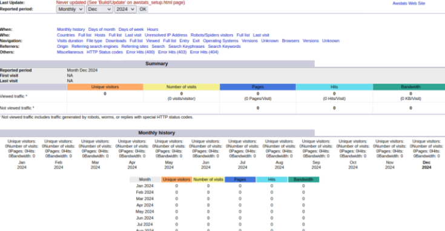
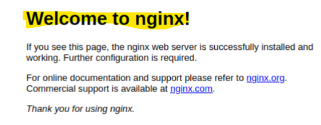
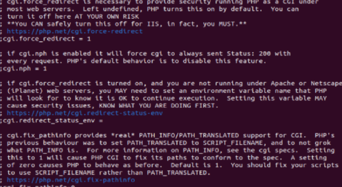

## Instalación de Apache y MySQL
### Instalación de Apache

1. Abrimos una terminal en Linux

<br>

<br>

2. Actualizamos los paquetes instalados e instalamos las nuevas versiones
`````
sudo apt update
`````

````
sudo apt upgrade
````
3. Ahora instalaremos Apache de forma adecuada haciendo lo siguiente:
`````
sudo apt install apache2
`````

`````
sudo ufw app list
`````
`````
sudo ufw allow "Apache"
`````
4. Por último escribiremos en nuestro navegador: "https://localhost" y veremos lo siguiente:

<br>

<br>

### Instalación de MySQL
1. Abrimos una terminal en Linux de nuevo e instalaremos MySQL de la siguiente forma:
`````
sudo apt install mysql-server
`````
Deberemos, también, configurar MySQLServer:
`````
sudo mysql_secure_installation
`````
### Instalaremos Wordpress
1. Instalamos, primero, "unzip" con:

````
sudo unzip latest.zip
````

2. Luego descargaremos el archivo de instalación de Wordpress con el comando de abajo Y extraemos los archivos con el "unzip" instalado anteriormente.

````
wget https://es.wordpress.org/latest.zip
````

3. Ahora deberemos poner los contenidos de Wordpress a nuestra carpeta del dominio

````
sudo mv wordpress/* /var/www/html/
````

4. Por último modificaremos le concederemos permisos a la carpeta:

````
sudo chown -R www-data:www-data /var/www/html/*
````
### Preparando Wordpress

1. Creamos un archivo para configuración con "sudo nano /etc/apache2/sites-available/wordpress.conf" y escribimos:

````
<VirtualHost *:80>
    DocumentRoot /var/www/html
    ServerName Wordpress.local
    ServerAdmin admin@localhost
</VirtualHost>
````

2. Habilitaremos la página de Wordpress escribiendo

````
sudo a2ensite wordpress
````

3. Deshabilitamos la página por defecto de Apache con "sudo a2dissite 000-default" y añadimos el dominio al fichero hosts:

````
sudo nano /etc/hosts
````
4. Por último recargaremos Apache con "sudo service Apache2 reload"

### Wordpress
1. Empezamos con la configuración del propio Wordpress eligiendo el idioma y otros parametros que veremos más adelante:





(Se recomienda que el usuario sea "admin")

2. Si todo ha salido bién, veremos lo siguiente:



### La base de datos
1. Accedemos a MySQL como administradrores con:

````
sudo mysql -u root
````

2. Creamos nuestra base datos poniendo "CREATE DATABASE" y el nombre que le querramos poner
````
CREATE DATABASE Wordpress;
````
3. Ahora tendremos que crear un usuario admininistrador y le asignamos los privilegios a dicho usuario

````
CREATE USER 'admin'@'localhost'  IDENTIFIED  BY 'admin';
````
````
GRANT ALL PRIVILEGES -> ON wordpress.* -> TO 'admin'@'localhost';
````

( Es importante actualizar los privilegios de nuestra base de datos con: "FLUSH PRIVILEGES;")

4. Cerramos la sesión de MySQL con "quit"

<br>

<br>

### Conexión Wordpress/DB

1. Primero deberemos modificando el archivo de configuración de WordPress que viene por defecto para que se conecte a la base de datos:

````
sudo -u www-data nano /srv/www/Wordpress/wp-config.php
````

2. Una vez dentro sustituiremos cada punto con el nuestro (en "NAME" pondremos el nombre de nustra base de datos y así sucesivamente).

### WSGI

1. Instalaremos Python escribiendo este comando en el CPD de Linux y posteriormente instalaremos "WSGI":
````
sudo apt install python3 libexpat1 -y
````
````
sudo apt install libapache2-mod-wsgi-py3 -y
````
2. Para comprobar que funciona escribiremos "sudo nano /var/www/html/wsgi_a.py" y escribimos dentro lo siguiente:
````Python
def application(environ, start_response):
    status = '200 OK'
    output = b'Hello !\n'

    response_headers = [
        ('Content-type', 'text/plain'),
        ('Content-Length', str(len(output)))
    ]

    start_response(status, response_headers)
    return [output]
````
3. Es importante que en el archivo de nuestro virtualhost tendremos que escribir"WSGIScriptAlias / /var/www/html/wsgitest.py" para asegurarnos de que podemos usar Python

(No olvidarnos de ahora en el dominio habra que poner al final "WSGI")

### AWSTAT
1. Instalamos AWSTAT mediante el siguiente comando "sudo apt-get install awstats" y habilitamos el módulo CGI con:

````
sudo a2enmod cgi alias
````
(Debemos reiniciar Apache)

2. Ahora deberemos duplicar el archivo AWSTAT y editarlo:
````
sudo cp /etc/awstats/awstats.conf /etc/awstats/awstats.Nombre-Dominio.conf
````

````
sudo nano /etc/awstats/awstats.Nombre-Dominio.conf
LogFile="/var/log/apache2/access.log"
SiteDomain="Dominio.com"
HostAliases="www.Dominio.com localhost 127.0.0.1"
````
3. Para generar las estadísticas con esta herramienta deberemos escribir este código:

````
sudo /usr/lib/cgi-bin/awstats.pl -config=Nombre-Dominio -update
````
4. Y generamos un index para las de estadisticas:
````
sudo /usr/lib/cgi-bin/awstats.pl -config=Dominio.com -output > /var/www/html/index.html
````
5. Se vería algo así:


### Segundo servidor
1. Para esto usaremos Nginx:
````
sudo apt-get install nginx
````
(Hay el firewall con "sudo ufw allow 'Nginx HTTP'")

2. Procederemos, ahora si, a la creacción de la carpeta que usaremos para nuestra web junto con el archivo de configuracion de nuestro dominio:
````
sudo mkdir /var/www/server2
````
````
sudo nano /etc/nginx/sites-available/servidor2.centro.intranet
````
3. Dentro debemos escribir este código:
````
server {
    listen 8080;
    server_name server2.centro.intranet;

    root /var/www/server2.centro.intranet;
    index index.php index.html index.htm;

    location / {
        try_files $uri $uri/ =404;
    }

    location /phpmyadmin {
        root /var/www/html;
        index index.php;
        try_files $uri $uri/ =404;

        location ~ \.php$ {
            include snippets/fastcgi-php.conf;
            fastcgi_pass unix:/var/run/php/php8.1-fpm.sock; # Ajusta según tu versión de PHP
            fastcgi_param SCRIPT_FILENAME $document_root$fastcgi_script_name;
            include fastcgi_params;
        }
    }

    location ~ /\.ht {
        deny all;
    }
}
````
4. Configuraremos adecuadamente el host:
````
111.111.111.111 servidor2.centro.intranet
````
(Tenemos que reiniciar el servicio Nginx con "sudo service nginx restart")

Por último activamos la web con:
````
sudo ln -s /etc/nginx/sites-available/servidor2.centro.intranet /etc/nginx/sites-enabled/
````


### PHP
1. Instalamos PHP y configuramos "PHP-FPM":
````
sudo apt install php-fpm php-mysql php-mbstring php-zip php-gd php-json php-curl -y
````
````
sudo nano /etc/php/8.1/fpm/php.ini
````
````
cgi.fix_pathinfo=0
````
Deberíamos ver esto:

