# Instalación y Configuración de WordPress en AWS con Ubuntu
## VPC
Tendremos que desde AWS acceder a VPC y configurar una de estas:


En mi caso usare una creada anteriormente con la IP `10.2.0.0/16` y con los siguientes detalles:


## EC2
Entramos en EC2 desde AWS y lanzamos una instancia a la que he llamado "Wordpress" y el Sistema Operativo es Ubuntu en su versión más reciente:

<br>
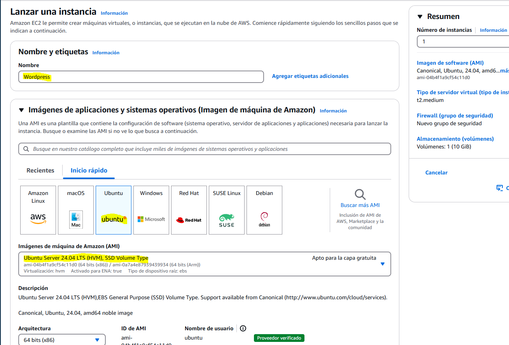
<br>

Tendremos que poner esta configuración, usaremos la clave `vockey` y **LO MÁS IMPORTANTE** elegir la VPC que usaremos para esta práctica ('SREIpractica1' en mi caso). Por último agregar una regla para permitir HTTP desde cualquier origen.

<br>
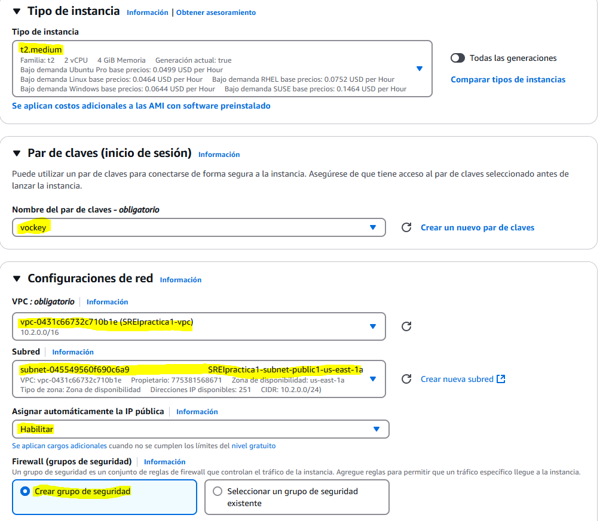
<br>

Terminamos de configurarla:

<br>
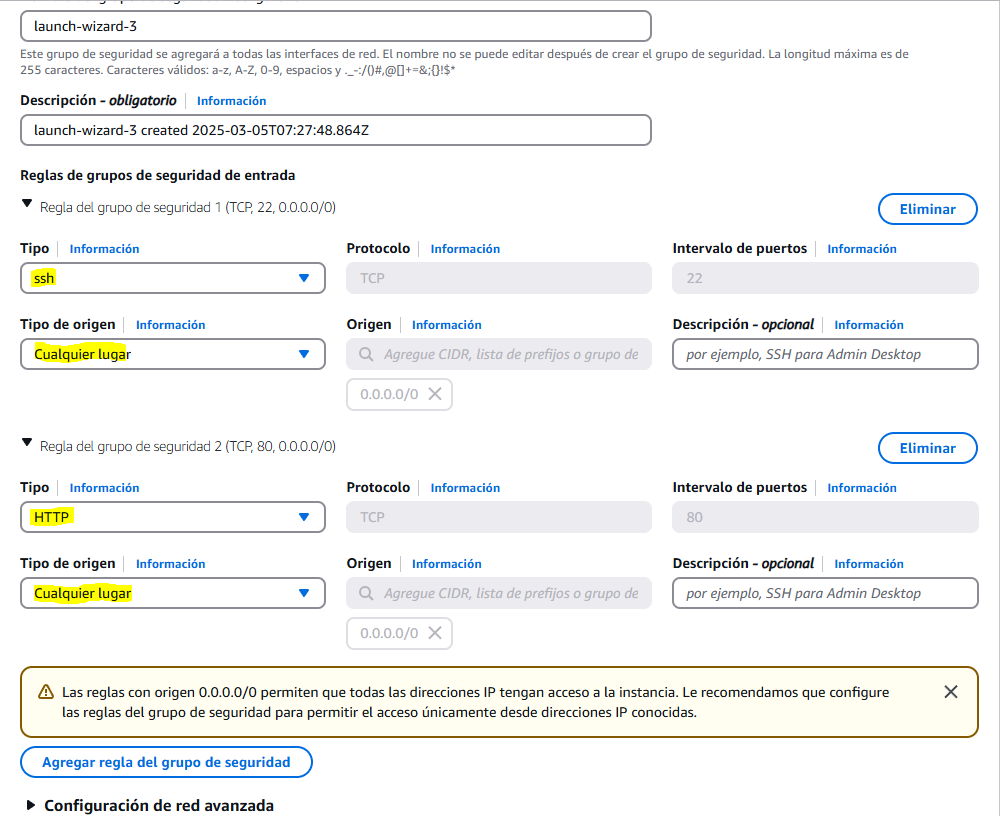
<br>

Y ya sea con Putty o con la opción de "Conectar" de AWS (esta última es la opción que yo he elegido) entramos:

<br>
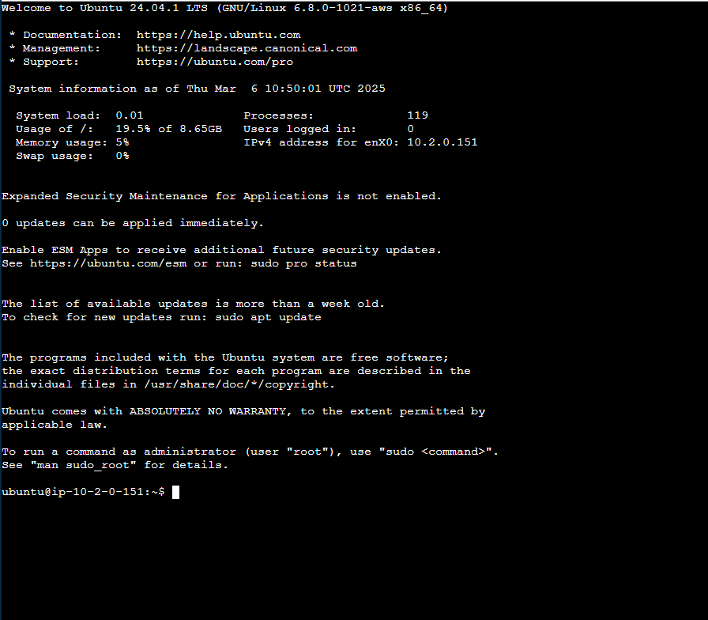
<br>

## Apache y PHP
Actualizamos el sistema como lo hariamos en cualquier maquina ubuntu.
```
sudo apt update
```
```
sudo apt upgrade -y
```
<br>
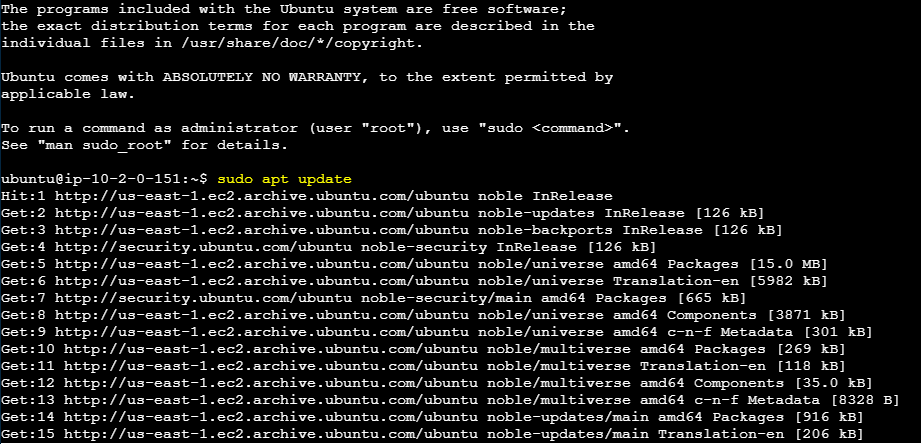
<br>
<br>
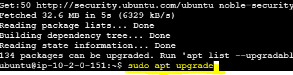
<br>

E instalarmos Apache con el siguiente comando:
```
sudo apt install apache2 -y
```
<br>
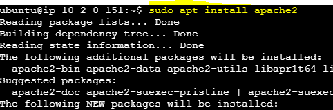
<br>

La forma de iniciar Apache y usarlo es con los comandos:
```
sudo systemctl start apache2
sudo systemctl enable apache2
```

<br>
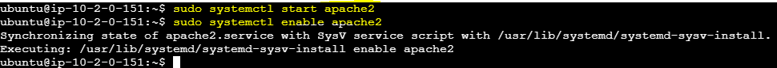
<br>

Y cuando pongamos la IP de nuestra instancia en el navegador veremos que se instalo correctamente:

<br>
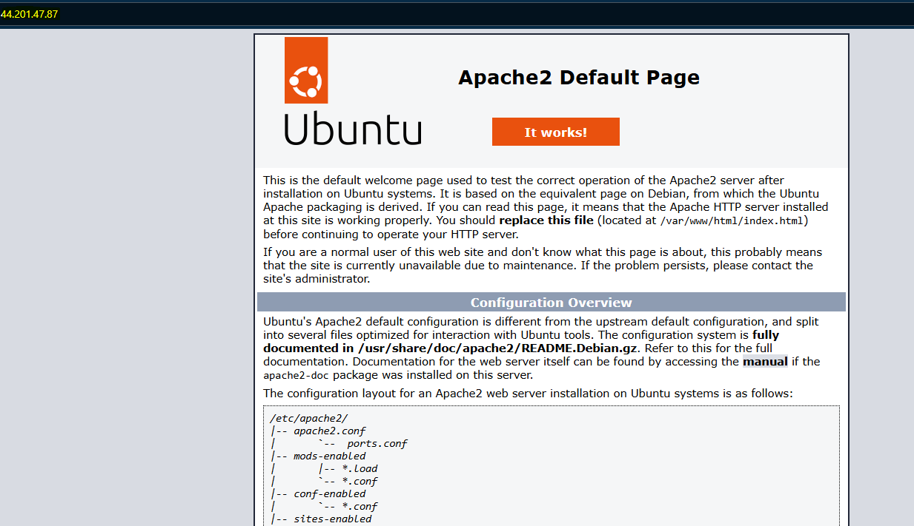
<br>

Ahora, para instalar PHP:
```
sudo add-apt-repository ppa:ondrej/php
```
```
sudo apt install php7.4 libapache2-mod-php7.4 php7.4-cli php7.4-mysql -y
```
<br>
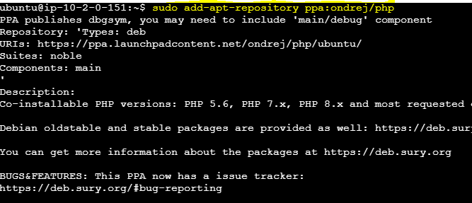
<br>
<br>
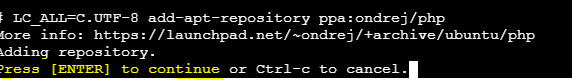
<br>
<br>
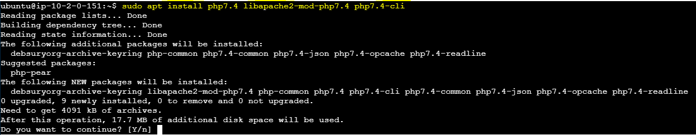
<br>

Reiniciar Apache:
```
sudo systemctl restart apache2
```
<br>
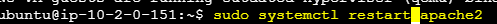
<br>

## RDS

Nos dirigimos a RDS para crear la base de datos:


Tendremos que poner esta configuración:

<br>
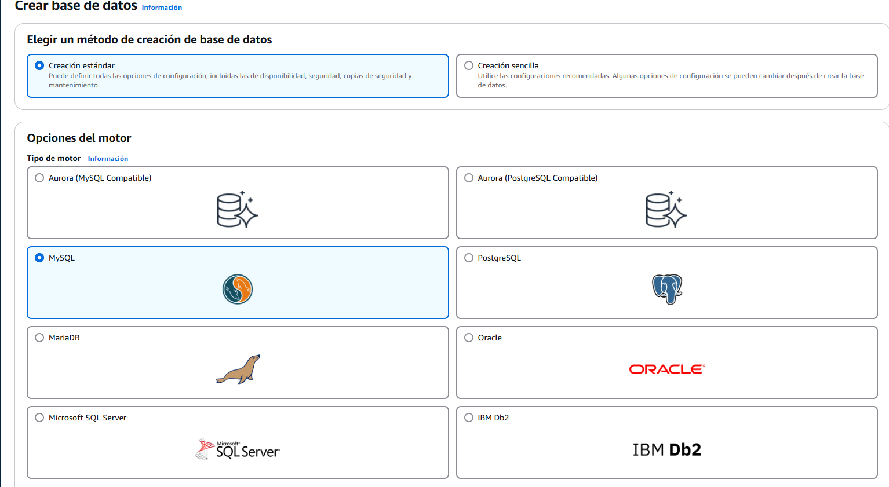
<br>

<br>
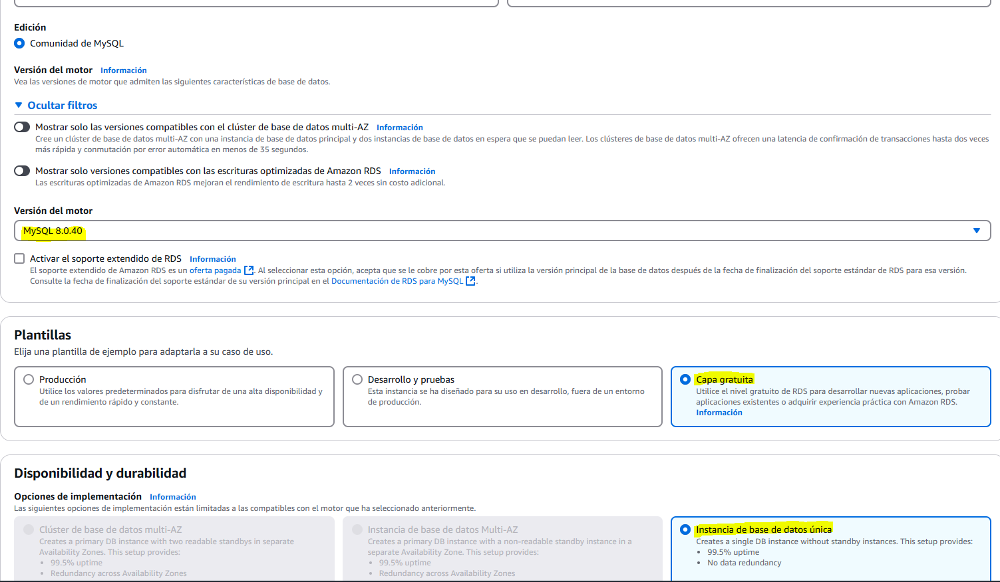
<br>

Importante añadir la VPC en la base de datos:

<br>
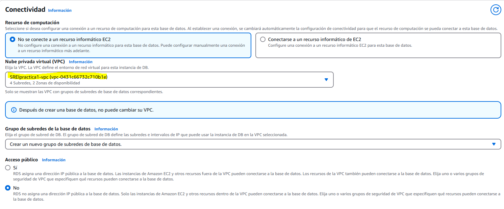
<br>

Creamos un nuevo grupo de seguridad le ponemos el nombre 

<br>
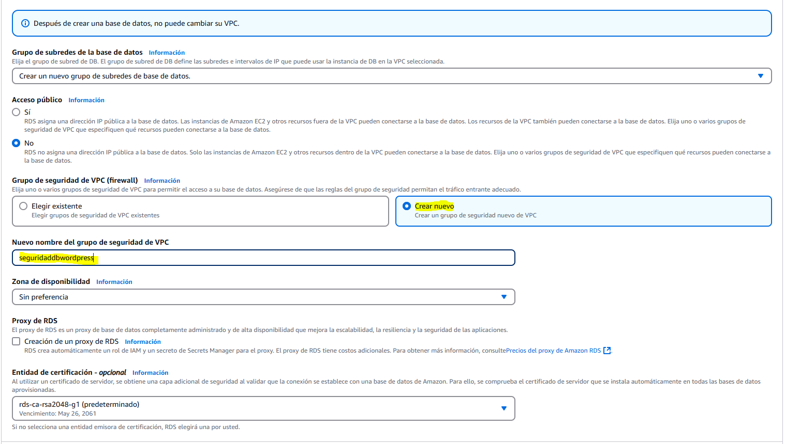
<br>

Tendremos que poner una contraseña a la base de datos la cual **NO** podemos olvidar:

<br>
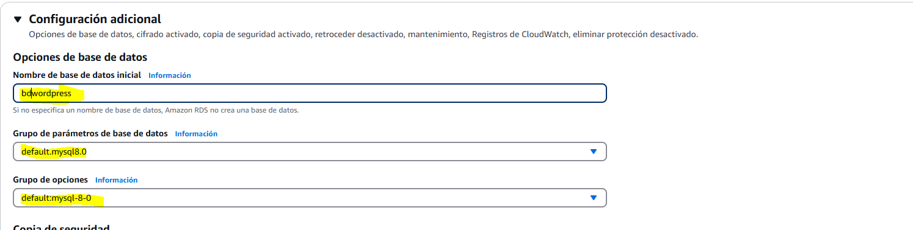
<br>

Una vez se cree la RDS nos vamos a "Acciones" y "Configurar la conexión EC2":


Y ponemos nuestra instancia:

<br>
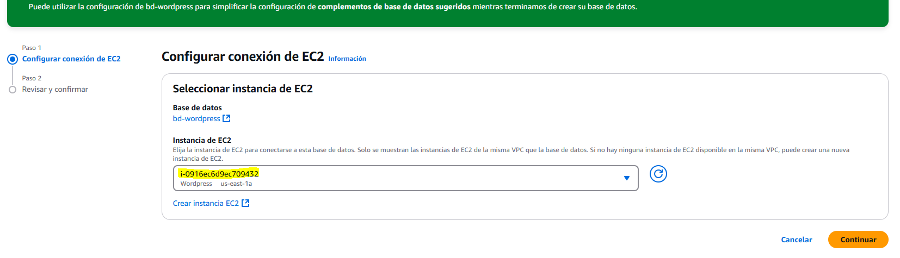
<br>


## EFS
Buscamos EFS en AWS y seleccionamos "Crear sistema de archivos", debemos asignar un nombre y elegir la VPC creada y muy importante, configurar una regla en la VPC para permitir conexiones NFS. 


<br>
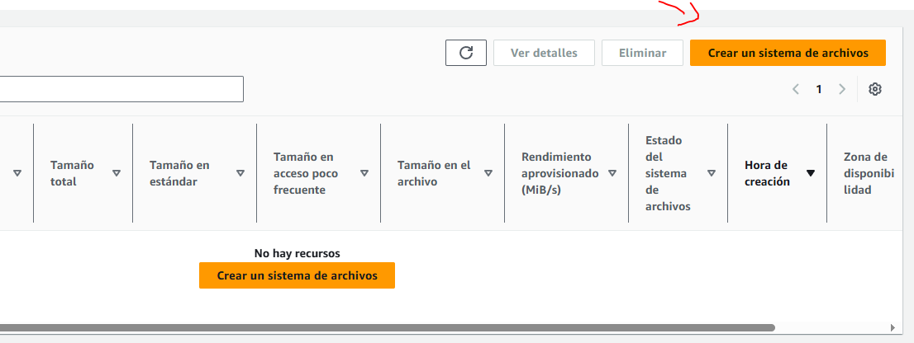
<br>

<br>
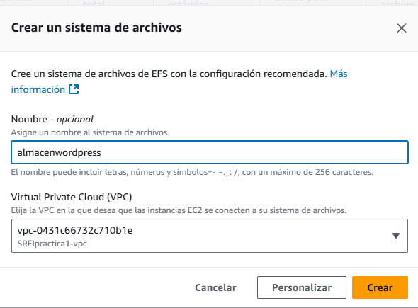
<br>

<br>
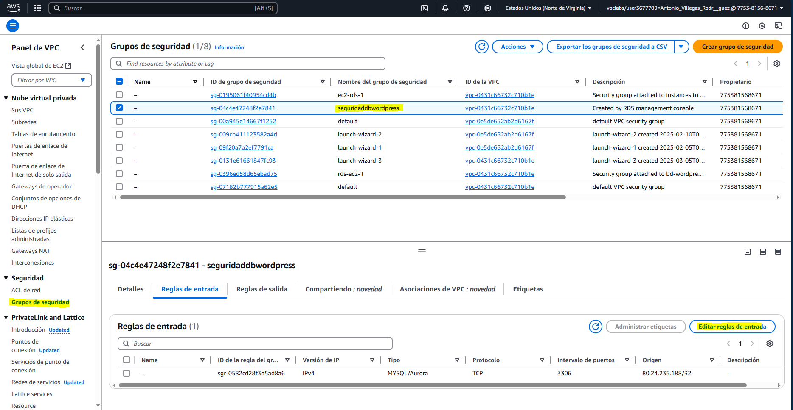
<br>
